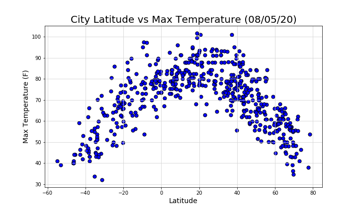
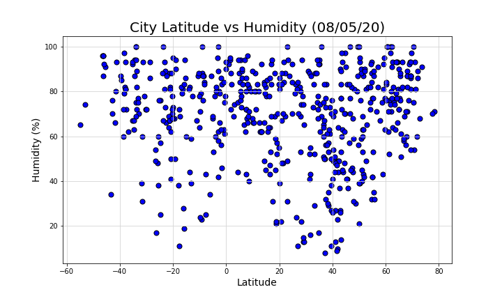
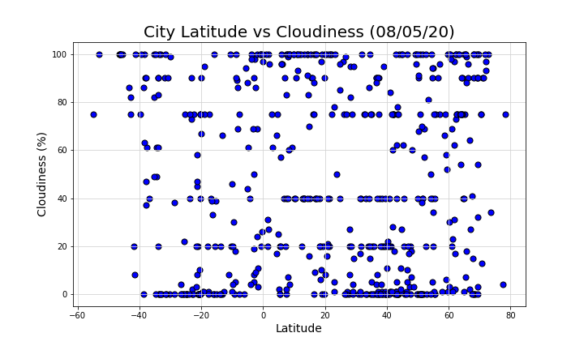
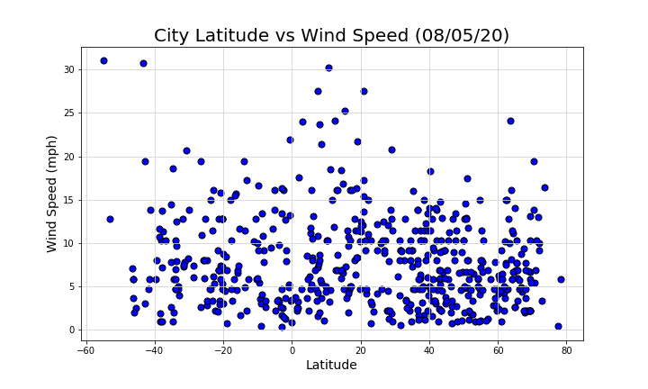

# WeatherPy

In this exercise, I created a script to visualize the weather of 500+ cities across the world of varying distance from the equator using the OpenWeatherMap API. From this data, a series of scatter plots are made to determine the relationship, if any, between a city's latitude and various weather conditions.

### Analysis

1. There is a definite correlation between the latitude of a city and it's maximum temperature. The farther away a city is from the equator, the lower the maximum temperature is. This correlation in the southern hemisphere is slightly stronger with an r-squared value of 0.62, compared to the one in the north at 0.53.

2. There was almost no correlation between Humdity and Latitude in the northern hemisphere and only a slight negative correlation in the southern hemisphere, with both the r-squared values being close to zero (0.00 vs. 0.02, repectively).

3. While the southern hemisphere has a slight negative correlation when looking at Cloudiness vs. Latitude, both the r-squared values for the northern and southern hemisphere are close to zero (0.00 vs. 0.02, repectively).

4. Wind Speed vs. Latitude shows a slight negative correlation for both the northern and southern hemisphere, however both the r-squared values are being close to zero (0.03 vs. 0.01, repectively).

**Conclusion**

Out of all the weather conditions looked at in this study, the only one with a strong correlation to latitude is maximum temperature. For the southern hemisphere, especially, 62% of the variance can be explained by the linear model. 

------------------------------------
**WeatherPy Instructions:**

In this example, you'll be creating a Python script to visualize the weather of 500+ cities across the world of varying distance from the equator. To accomplish this, you'll be utilizing a simple Python library, the OpenWeatherMap API, and a little common sense to create a representative model of weather across world cities.

Your first requirement is to create a series of scatter plots to showcase the following relationships:

* Temperature (F) vs. Latitude
* Humidity (%) vs. Latitude
* Cloudiness (%) vs. Latitude
* Wind Speed (mph) vs. Latitude

After each plot add a sentence or two explaining what the code is and analyzing.
Your second requirement is to run linear regression on each relationship, only this time separating them into Northern Hemisphere (greater than or equal to 0 degrees latitude) and Southern Hemisphere (less than 0 degrees latitude):

* Northern Hemisphere - Temperature (F) vs. Latitude
* Southern Hemisphere - Temperature (F) vs. Latitude
* Northern Hemisphere - Humidity (%) vs. Latitude
* Southern Hemisphere - Humidity (%) vs. Latitude
* Northern Hemisphere - Cloudiness (%) vs. Latitude
* Southern Hemisphere - Cloudiness (%) vs. Latitude
* Northern Hemisphere - Wind Speed (mph) vs. Latitude
* Southern Hemisphere - Wind Speed (mph) vs. Latitude

After each pair of plots explain what the linear regression is modeling such as any relationships you notice and any other analysis you may have.

The final notebook will contain:

* Randomly select at least 500 unique (non-repeating) cities based on latitude and longitude.
* Perform a weather check on each of the cities using a series of successive API calls.
* Include a print log of each city as it's being processed with the city number and city name.
* Save a CSV of all retrieved data and a PNG image for each scatter plot.

------------------------------------
**VacationPy Instructions:**

Using the data retrieved in the WeatherPy exercise, I narrowed down the data to my ideal weather conditions:

* Temperature between 65F and 80F
* Humidity between 30 and 50
* Cloudiness at less than 20%
* Wind Speed at less than 15mph

Using the Google Places API, I found a hotel within a 5000 meter radius for each city on my list. After adding the hotel to the list, I created a heatmap using gmaps with markers noting the hotel that was chosen for each city on my list.